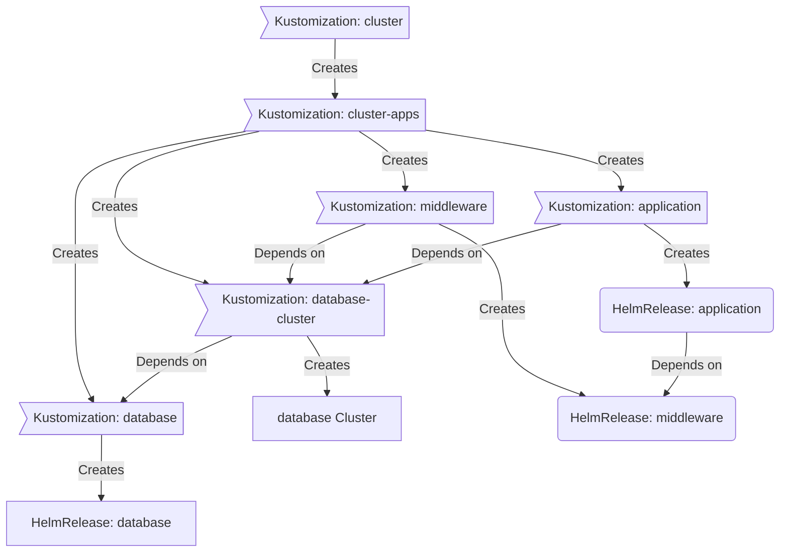

### 🤖 My Flux Gitops Repository :octocat:


Manage everything with Git, Flux, Renovate


</div>


---


## 📖 Overview


This is a repository for my Kubernetes cluster. I try to adhere to Infrastructure as Code and GitOps patterns using tools like [Kubernetes](https://kubernetes.io/), [Flux](https://github.com/fluxcd/flux2), [Renovate](https://github.com/renovatebot/renovate).


---


## ⛵ Kubernetes


### Installation


My Kubernetes cluster is hosted on [FUGA Cloud](https://fuga.cloud) Managed Kubernetes Platform (i am also owner of the company and try to use as many services for my personal projects and interests). This highly optimzed and scaleable cloudplatform is developed with a lot opensource technologies like Openstack, Ceph and Gardener and Zitadel. Let's learn from each other and give me a ping if you want a free sandbox Gardnener Kubernetes environment


### Base Components


- [cni cilium](https://github.com/cilium/cilium): Swiss army knife of many networking services
- [traefik proxy](https://traefik.io): Web application proxy used for anything communicating to the cluster externally
- [external-dns](https://github.com/kubernetes-sigs/external-dns): Automatically syncs ingress DNS records to FUGA Cloud Anycast DNS service
- [cert-manager](https://github.com/cert-manager/cert-manager): Creates and Maintain Multiple Wildcard SSL certificates for services
- [external-secrets](https://github.com/external-secrets/external-secrets): Managed Kubernetes secrets the smart way using [1Password Connect](https://github.com/1Password/connect)
- [cloudnativePG](https://cloudnative-pg.io): Postgres Operator with S3 backups and lifecycle support
- [redis](https://redis.io): NoSQL database and an in-memory data store
- [csi-juicefs](https://github.com/juicedata/juicefs): CSI controller for encrypted and persistant S3 storage 
- [csi-rclone](https://github.com/wunderio/csi-rclone): CSI controller for mounting S3 storage buckets
- [zitadel](https://github.com/zitadel/zitadel): OIDC/SAML/LDAP SSO identity service
- [oauth2-proxy](https://github.com/oauth2-proxy/oauth2-proxy): Oauth2/OIDC authentication proxy service
- [grafana oss](https://grafana.com/oss/grafana/): Grafana Labs dashboard services
- [grafana loki oss](https://grafana.com/oss/loki/): Grafana Labs log aggregation system
- [kube-prometheus-stack](https://github.com/prometheus-community): Prometheus community monioring stack
- [webfinger]: nginx with parcal (javascript) for dynamic webfinger lookups e.g. tailscale oidc


### Applications


- [teslamate](https://github.com/teslamate-org/teslamate): Self-hosted data logger for my Tesla Model X
- [plex/arrr's](https://wiki.servarr.com): Populair media services for my seedbox
- [tailscale](https://github.com/tailscale/tailscale): Feature rich zero networking framework
 ### GitOps


[Flux](https://github.com/fluxcd/flux2) watches the clusters in my [gitops-flux](./gitops-flux/) folder (see Directories below) and makes the changes to my clusters based on the state of my Git repository.


The way Flux works for me here is it will recursively search the `gitops-flux/${cluster}/apps` folder until it finds the most top level `kustomization.yaml` per directory and then apply all the resources listed in it. That aforementioned `kustomization.yaml` will generally only have a namespace resource and one or many Flux kustomizations (`kustomization.yaml`). Under the control of those Flux kustomizations there will be a `HelmRelease` or other resources related to the application which will be applied.


[Renovate](https://github.com/renovatebot/renovate) watches my **entire** repository looking for dependency updates, when they are found a PR is automatically created. When some PRs are merged Flux applies the changes to my cluster. Minor patches auto automerged to the repository and automatically reconsiled to the clusters with Flux.


### Directories


This Git repository contains the following directories under [gitops-flux](./gitops-flux/).


```sh
📁 gitops-flux
├── 📁 bandit             # Bandit cluster
│   ├── 📁 apps           # Applications
│   ├── 📁 base           # bootstrap services
│   └── 📁 core           # core flux configuration
├── 📁 cluster A          # Next cluster
│   ├── 📁 apps           # Applications
│   ├── 📁 base           # bootstrap services
│   └── 📁 core           # core flux configuration
└── 📁 cluster Z          # Last cluster
   ├── 📁 apps           # applications
   ├── 📁 base           # bootstrap Applciations
   └── 📁 core           # core flux configuration
```


### Flux Workflow and Dependencies


This is a high-level look how Flux deploys my applications with dependencies. Below there are 3 apps `database`, `middleware` and `application`. `database` will be deployed in `database-cluster`' and needs to be running and healthy before `middleware` and `application`. Once `database` is healthy `middleware` will be deployed and after that is healthy `application` will be deployed.



---


## 🔧 Planned updates or things under investigation


- Security: Clean up and move old experiments/secrets/configmaps to external-secret or just sops it to make this repo public
- Dependencies: DependsOn is not fully defined
- Tailscale operator: Getting seedbox ingress in tailnet
- Experimenting with [Supabase](https://github.com/supabase/supabase) a firebase alternative for [Appflowy](https://appflowy.io) a selfhosted notion and [Feedbase](https://feedbase.app)
- Longterm: replace all ingress and ingressroute (traefik) definitions to httproute with Kubernetes Gateway API 


---


## 🤝 Gratitude and Thanks


Thanks to all the people who donate their time to reddit /r/selfhosted and discord home-operations community. Be sure to check out [kubesearch.dev](https://kubesearch.dev/) for ideas on how to deploy applications or get ideas on what you may deploy. Special thanks to Devin Buhl [Onedrop](https://github.com/onedr0p) for his home-ops repo and optimized media/arrr/seedbox images,
Bernd Schorgers [bjw-s](https://github.com/bjw-s) for the common helm-chart development and Adrian Kumpf [adriankumpf](https://github.com/adriankumpf) from the teslamate project. The [Zitadel](https://github.com/zitadel/zitadel) Team.
